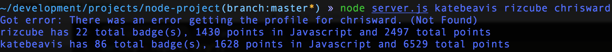

[](https://codeclimate.com/github/katebeavis/command-line-node)
# Command Line Badge Finder
Command Line Badge Finder is a Node.js app that takes usernames of Treehouse members as an argument and returns the total number of their badges, Javascript points and total points, by making an api call to Treehouse.

I did this project in order to get a firm understanding of the basics of Node.js and how it differs from other frameworks such as Sinatra.

##Screenshots
<div align="center">
  
</div>

##Technology
- Node.js


##To Run
```
$ git clone https://github.com/katebeavis/command-line-node.git
$ cd command-line-node
$ node server.js <username>
```
